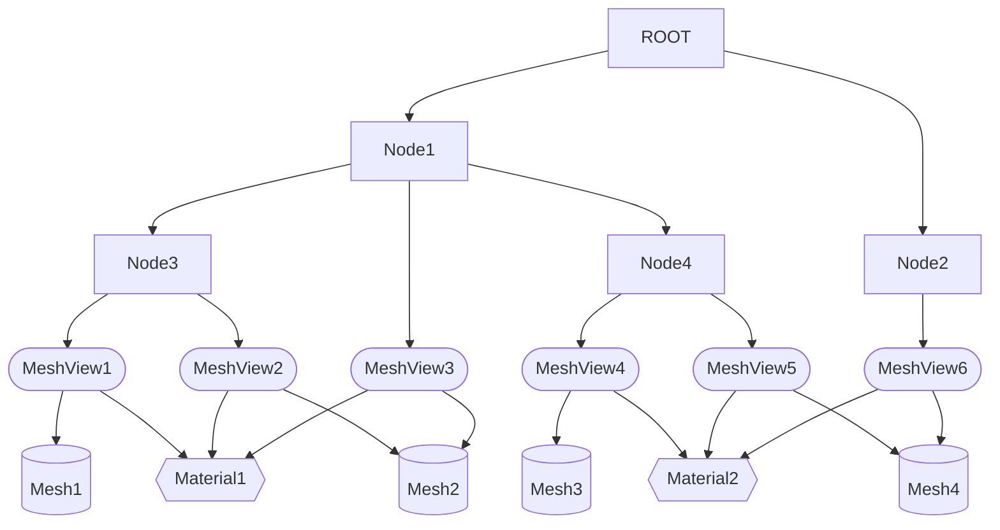
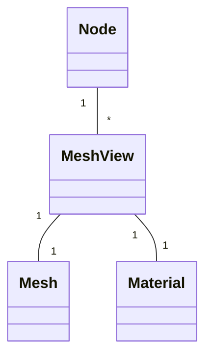
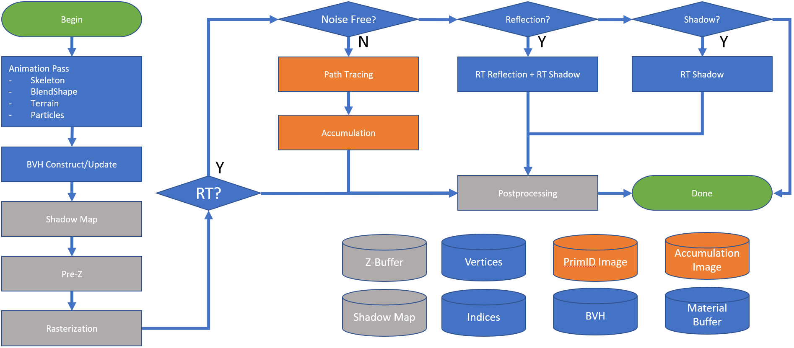
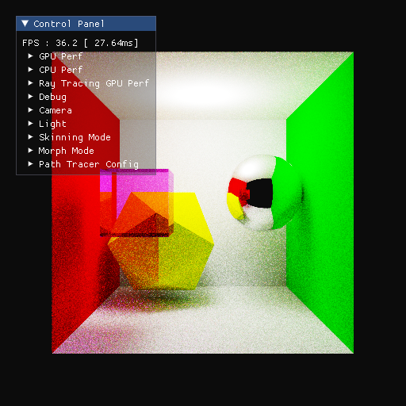
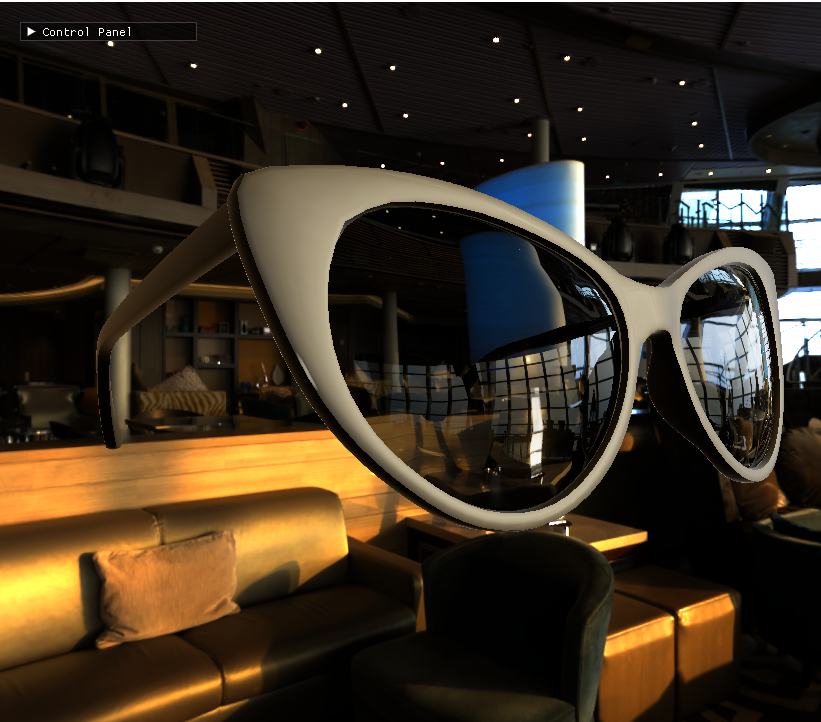

# PhysRay-SDK

PhysRay SDK is a high performance modern graphics/compute SDK on OPLUS platform. It is mainly focusing on giving developers the ability to quickly utilize the
latest graphics features provided by modern Android platform, such as real time ray tracing and heterogenous computing. The SDK is split into a few modules.
Each covers an main feature area of the SDK.

# Base Module
  
This is the basic supporting module that provides commonly used class and utilities shared by all other modules of PhysRay SDK, such as:
- Logging
- Asset management
- File and memory management
- Math
- Pixel format and image utilities

# VA (Vulkan Accelerator) Module

This is the Vulkan utility library that provides basic Vulkan dev environment. It is also aiming for making those common Vulkan programming tasks less verbose.

For example, using helpers classes from VA module, you can create a Vulkan instance and device with only a few lines of code:

```c++
    #include <ph/va.h>

    // Initialize Vulkan instance with default options. Customize icp to load extra extensions and/or layers.
    ph::va::SimpleVulkanInstance::ConstructParameters icp;
    ph::va::SimpleVulkanInstance inst(icp);

    // Initialize VK device with default option. Customize dcp to enable extra extensions or features.
    ph::va::SimpleVulkanDevice::ConstructParameters dcp;
    dcp.instance = &inst;
    ph::va::SimpleVulkanDevice dev(dcp);
```

# RT (Ray Tracing) Module

This module provides a real time ray tracing solution for both desktop and mobile (Android) platform. It is built on
top of https://www.khronos.org/blog/ray-tracing-in-vulkan#:~:text=A%20ray%20tracing%20pipeline%20is,currently%20bound%20ray%20tracing%20pipeline.
{Vulkan ray tracing} standard released by Khronos Groups in 2020. The module is:
- Built on top of Vulkan 1.1 API.
- Rely on the following Vulkan ray query extensions for hardware accelerated ray tracing:
  - VK_KHR_ray_query
  - VK_KHR_acceleration_structure
  - VK_KHR_spirv_1_4
  - VK_KHR_descriptor_indexing
- Has a built-in shader based solution that provides same ray tracing abilities s what HW ray query has, but w/o any special hardware requirements.
- Has a real time ray tracer with limited but noise free effects
- Has a path tracer for offline rendering with advanced global illumination effects.

# RT.H

The public interface of the RT module is [rt.h](rt/public/inc/ph/rt.h). Everything you need to utilize the RT module is defined in this header.

Here's the top level design of the module:

<image src="rt-module.png" width=1080>

Among these components, **World**, **Scene** and **RenderPack** are the most important ones. They are the backbone of the module.

## The World Class

The World class is the factory class in RT module, it is responsible for creating instance of other classes used in RT module, as well as managing the
global information of the RT module. 1 and only 1 instance of the World class should be created before any other features of RT module is used.

Here's an example code of creating a World class:

```c++
    // include the public header of the RT module
    #include <ph/rt.h>

    // Initialize VK instance with hardware ray query capabilities.
    // Note that this example code creates an offscreen instance.
    // Please check out comments of SimpleVulkanInstance::ConstructParameters
    // for how to create an VK instance that renders to a window.
    ph::va::SimpleVulkanInstance::ConstructParameters icp;
    ph::rt::setupInstanceConstructionForRayQuery(icp, true);
    ph::va::SimpleVulkanInstance inst(icp);

    // Initialize VK device with hardware ray query capabilities.
    ph::va::SimpleVulkanDevice::ConstructParameters dcp;
    dcp.instance = &inst;
    ph::rt::setupDeviceConstructionForRayQuery(dcp, true);
    ph::va::SimpleVulkanDevice dev(dcp);

    // Setup world creation parameters
    ph::rt::WorldCreateParameters wcp {
        .vsp = dev.graphicsQ(),

        // use VK_KHR_ray_query based BVH.
        .bvhType = ph::rt::WorldCreateParameters::BVH_RAY_QUERY,
    };

    // Create the world.
    auto world = ph::rt::createWorld(wcp);

    // Do your rendering here.

    // Delete the world will automatically release everything in RT module.
    ph::rt::deleteWorld(world);
```

## The Scene Class

Scene class is responsible for managing scene graph. It organize geometry and material data based on the scene graph specified the SDK user. It is also
responsible for managing internal GPU data buffers storing scene data.

In most cases, you probably only need 1 instance of Scene class, similar as World. But you are free to create as many scene instances as you like. One
possible usage is to construct a new scene at background, while the current scene is still rendering to hide the loading screen.

The scene manages the following objects:

| Name | Description |
| ---- | ----------- |
| Node | Define spatial hierarchy of the scene. |
| Mesh | Define shape of a object by a pair of vertex and index buffer. |
| Material | Define PBR shading parameters and textures. |
| MeshView | Used to attach material and mesh to a node. |

Here's an example scene graph:



As shown in the graph, the relationship between these classes follows these rules:
- Each node can have arbitrary number of MeshViews.
- Each mesh view belongs to 1 and only 1 node, contains 1 mesh and 1 material.
- Multiple mesh views can share same mesh and materials



---
**IMPORTANT**: In jun22 release, we only support adding items (such as mesh, node, materials) to the
scene. Removing them from the scene will be added in future release.

---

## Render Pack Class

Render pack class is where the RT rendering logic is contained. It is similar as the Vulkan pipeline object that encapsulate the rendering logic of the
pipeline. Also similar as Vulkan pipeline object, most of the render pack configuration happens at creation time via the creation parameter structure.
Once the render pack is created, its functionality is mainly immutable.

We currently have 2 render pack classes. The main one is `RayTracingRenderPack`.

## Render Pack Mode

The most important parameter to set when creating `RayTracingRenderPack` instance, is the `Mode` field. It set the render pack into one of the supported
render mode. The render mode enumeration defines what kind of ray tracing effect that render pack class will perform. We currently support 4 render modes:
- Rasterized

  This mode serves as a "RT OFF" mode that the scene will be rendered w/o any RT effects.

- Shadow tracing

  This mode is the fastest render mode that only shadow is being ray traced.

- Noise free

  This mode tries to renders ray traced shadow, as well as ray traced reflection & refraction, in realtime fashion, without producing any noises. This saves us
  from having to running a denoiser to cleanup the final image. It also shoots very few rays per pixel to generate all the effects, which makes it the most
  suitable mode for rendering real time ray tracing effect on mobile platform with limited processing power.

  Due to this "noise free" restrictions though, this modes does not support the advances ray tracing effects, such as area light and diffuse GI. It also only
  support reflection & refractions on smooth surfaces. 

- Path Tracing
  
  This mode is the most complete and most time consuming mode that implemented a full path tracer. It is capable of rendering full range of GI effects as well
  as supporting arbitrary shape of light.

# Shader Pipeline

The SDK comes with 2 shader pipeline. One is based on VK_KHR_ray_query extension and requires ray tracing capable GPU. The other is built on top of a custom
AABB tree based BVH that doesn't require any special hardware features.

Both of the shader pipeline support the above 3 rendering mode: path tracing, noise free and shadow tracing.

Here's the overall rendering diagram of the SDK:




# SDK Samples

The SDK comes with a few sample applications that demonstrates how to use our RT module to render ray traced scene on PC and mobile platform. It supports
loading 3D scene from GLTF and OBJ files.

## Cornell Box

Cornell Box is the de-facto "hello-world" scene that every ray tracing implementation probably have. We are no exception. It demonstrates the path tracer
render mode implemented by the SDK:



## Suzanne

This sample serves as our model viewer that you can use it to load and view any GLTF and OBJ files. It is running the the noise free pipeline which is
capable of rendering ray traced reflection and refraction effect in real time, as shown in the following screenshot:



## Shadow

This sample demonstrates real time rendered traced shadow. While rasterized shadow suffers aliasing (red colored pixels in the screenshot), the ray traced
shadow is completely aliasing free.


